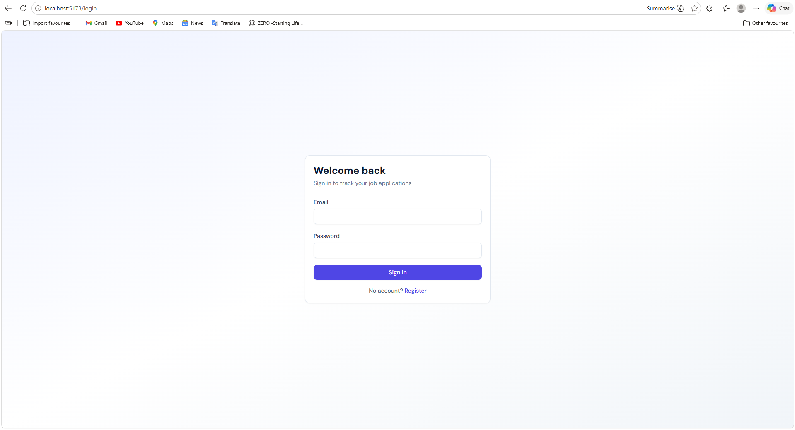
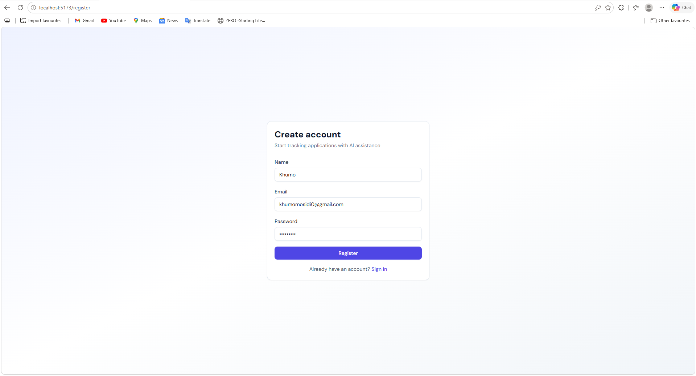
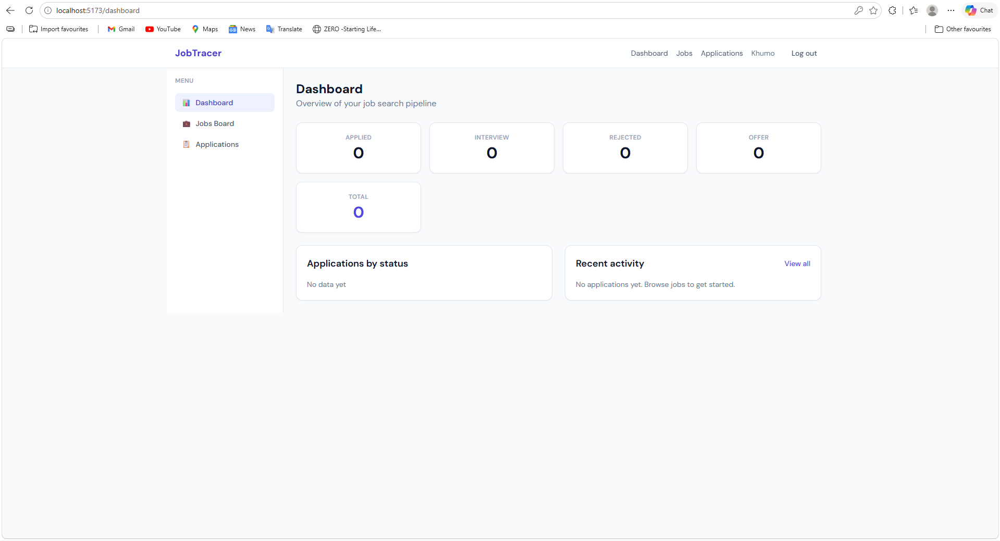
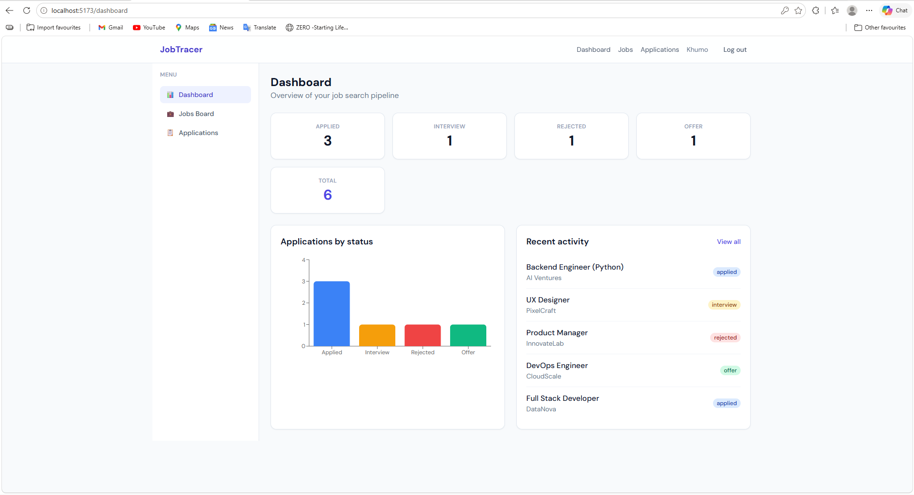
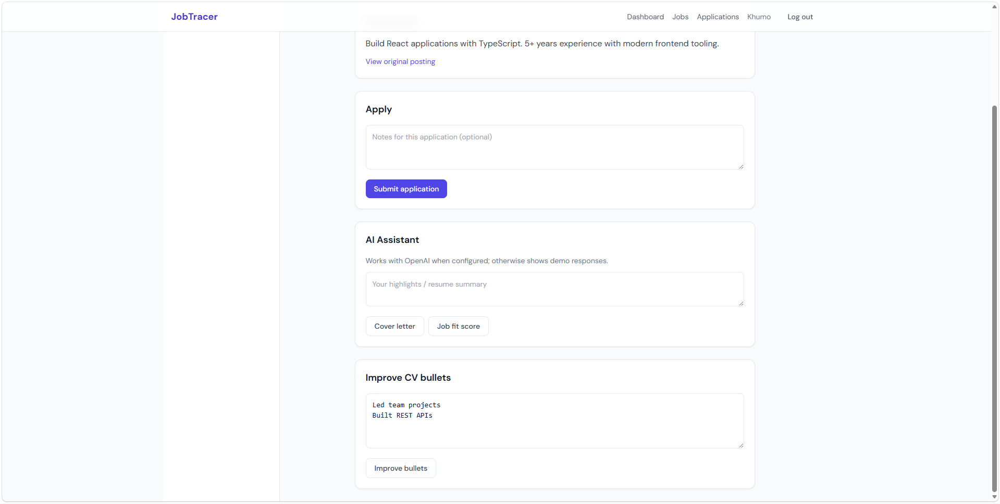
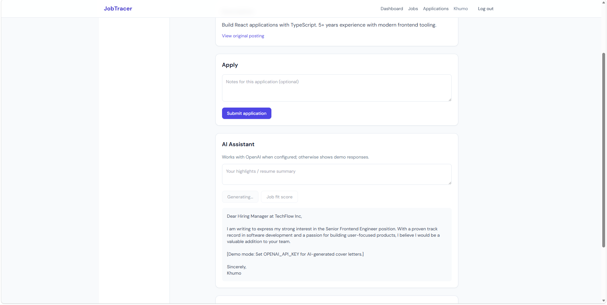
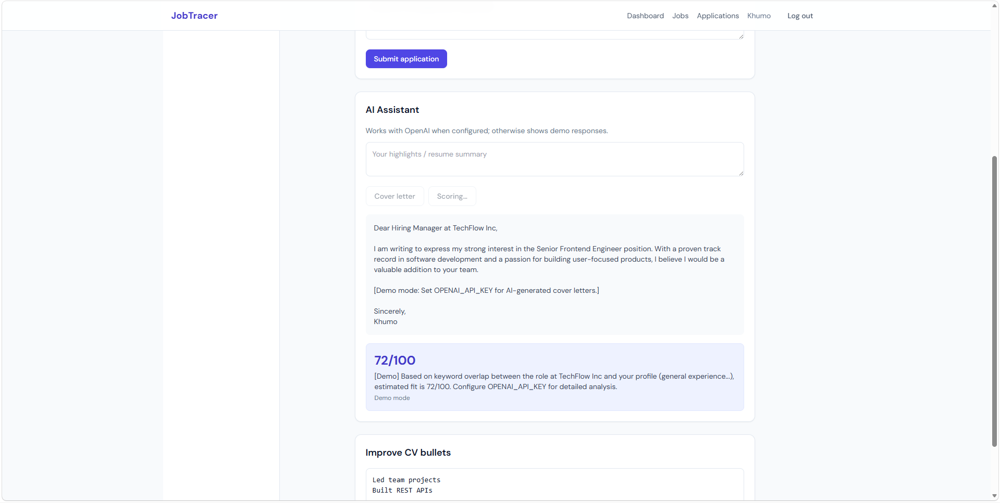

# Job Application Tracer

AI-powered job application tracker: browse jobs, apply, track pipeline status, and use AI for cover letters, CV improvements, and job-fit scoring.

## Screenshots

### Login & Registration
- **Login Page**
  
- **Registration Page**
  

### Dashboard
- **Empty Dashboard**
  
- **Active Dashboard with Stats**
  

### Applications
- **Applications List**
  

### Job Details & AI Assistant
- **AI Assistant (Cover Letter Demo)**
  
- **AI Assistant (Job Fit Score Demo)**
  


## Architecture

| Layer | Stack |
|-------|--------|
| Frontend | React 18, Vite, Tailwind CSS, React Query, Zustand, React Router, Recharts |
| Backend | Node.js, Express (ES modules) |
| Database | Supabase (PostgreSQL) via `@supabase/supabase-js` service role |

**Auth approach:** Custom JWT auth. Passwords are hashed with bcrypt and stored in `public.users.password_hash`. The backend signs JWTs (`Authorization: Bearer <token>`). The frontend stores the token in `localStorage`. Supabase is used as Postgres only (service role on the server), not Supabase Auth.

## Project structure

```
job-application-tracer/
├── frontend/          # Vite React app (port 5173)
├── backend/           # Express API (port 3001)
├── supabase/
│   └── migrations/
│       ├── 001_initial_schema.sql
│       └── 002_seed_jobs.sql
└── README.md
```

## Prerequisites

- Node.js 18+
- A [Supabase](https://supabase.com) project

## 1. Supabase setup

1. Create a project at [supabase.com](https://supabase.com).
2. Open **SQL Editor** and run:
   - `supabase/migrations/001_initial_schema.sql`
   - `supabase/migrations/002_seed_jobs.sql` (optional sample jobs)
3. From **Project Settings → API**, copy:
   - Project URL → `SUPABASE_URL`
   - `service_role` key → `SUPABASE_SERVICE_ROLE_KEY` (backend only, never expose to frontend)
   - `anon` key → `VITE_SUPABASE_ANON_KEY` (optional; reserved for future direct client use)

## 2. Backend configuration

```bash
cd backend
cp .env.example .env
```

Edit `backend/.env`:

```env
PORT=3001
SUPABASE_URL=https://xxxx.supabase.co
SUPABASE_SERVICE_ROLE_KEY=your-service-role-key
JWT_SECRET=use-a-long-random-string
OPENAI_API_KEY=              # optional — demo mocks used if empty
CORS_ORIGIN=http://localhost:5173
```

Install and run:

```bash
npm install
npm run dev
```

Seed jobs (after migration):

```bash
npm run seed
```

## 3. Frontend configuration

```bash
cd frontend
cp .env.example .env
```

Edit `frontend/.env`:

```env
VITE_API_URL=http://localhost:3001/api
VITE_SUPABASE_ANON_KEY=your-anon-key
```

Install and run:

```bash
npm install
npm run dev
```

Open [http://localhost:5173](http://localhost:5173).

## API routes

| Method | Path | Auth |
|--------|------|------|
| POST | `/api/auth/register` | No |
| POST | `/api/auth/login` | No |
| GET | `/api/auth/profile` | JWT |
| GET | `/api/jobs` | No |
| GET | `/api/jobs/:id` | No |
| POST | `/api/jobs` | JWT |
| GET/POST | `/api/applications` | JWT |
| GET/PATCH | `/api/applications/:id` | JWT |
| GET | `/api/dashboard` or `/api/applications/stats` | JWT |
| POST | `/api/ai/cover-letter` | JWT |
| POST | `/api/ai/cv-improve` | JWT |
| POST | `/api/ai/job-fit` | JWT |

## User flow

1. **Register / Login** → JWT stored in localStorage
2. **Dashboard** → stats by status, recent applications chart
3. **Jobs Board** → search and open job details
4. **Job Details** → apply (creates application), AI tools
5. **Applications** → update status (`applied` \| `interview` \| `rejected` \| `offer`)

## AI features

When `OPENAI_API_KEY` is set, the backend calls an OpenAI-compatible chat API (`OPENAI_BASE_URL`, `OPENAI_MODEL`). Without a key, deterministic demo responses are returned so the UI works offline.

## Development scripts

| Location | Command | Description |
|----------|---------|-------------|
| `backend/` | `npm run dev` | API with `--watch` |
| `backend/` | `npm run seed` | Insert sample jobs |
| `frontend/` | `npm run dev` | Vite dev server |
| `frontend/` | `npm run build` | Production build |

## Security notes

- Never commit `.env` files or service role keys.
- RLS is enabled on tables; the backend uses the service role and enforces ownership in application code.
- Rotate `JWT_SECRET` for production.

## Troubleshooting

- **DB errors:** Confirm migration SQL ran and env vars match your Supabase project.
- **CORS:** Ensure `CORS_ORIGIN` matches the Vite URL (`http://localhost:5173`).
- **401 on API:** Log in again; token may be expired (7-day default).
